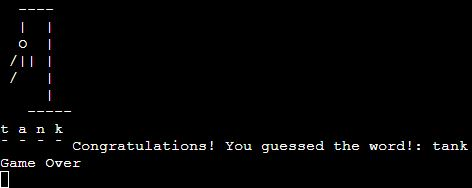

# Hangman

Welcome to the Hangman game! Test your word-guessing skills and try to uncover the hidden word.

**Developer: Marat Akbar Boyev**

[Visit live website](https://hangmanpp3.onrender.com)

# Table of Contents

- [How to Play Hangman](#how-to-play-hangman)
    - [Rules](#rules)
    - [Game Controls](#game-controls)

- [Features](#features)
    - [Existing Features](#existing-features)

- [Data Model](#data-model)

- [Testing](#testing)
    - [Bugs](#bugs)
        - [Solved Bugs](#solved-bugs)
        - [Remaining Bugs](#remaining-bugs)

- [Validator Testing](#validator-testing)

- [Deployment](#deployment)

- [Credits](#credits)

## How to play Hangman

Welcome to Hangman! This is a simple implementation of the classic Battleship game in Python.

- Enter your letter guesses when prompted.
- The game will display the current state of the word, the letters guessed, and the hangman figure.
- If you correctly guess a letter, it will be revealed in the word.
- If you incorrectly guess a letter, the hangman figure will progress.
- The game ends when either you correctly guess the word or reach 7 incorrect guesses.

#### Rules
- The game randomly selects a word from the predefined word pool.
- You have to guess the letters of the word to reveal it.
- You are allowed 7 incorrect guesses before the game ends.
- Input must be a single letter.

#### Game Controls
- Enter your letter guesses when prompted.
- The game will display the current state of the word, the letters guessed, and the hangman figure.
- If you correctly guess a letter, it will be revealed in the word.
- If you incorrectly guess a letter, the hangman figure will progress.
- The game ends when either you correctly guess the word or reach 7 incorrect guesses.

## Features

### Existing Features
- Random selection of words from a predefined word pool.
- Visual representation of the hangman figure.

- Display of the current state of the word and guessed letters.

## Data Model
- The game uses a list of predefined words as the word pool.
- The chosen word is randomly selected from this pool.

## Testing
I conducted manual testing on this project, which involved the following steps:

- Ran the code through a PEP8 linter to ensure there are no issues.
- Tested the project in both my local terminal and the Code Institute Render terminal.

### Bugs
- The game was tested using PEP8 with a result of 13 errors and warnings. Mostly was blank lines problems and other whitespacing.

#### Solved Bugs
- Bugs were fixed by adding correct indentation, spacing between codes and too long coding text.

### Remaining Bugs
- No Remaining Bugs left.

## Validator Testing
- PEP8 was used as a validator with 13 bugs as a result.

## Deployment
This project was deployed using Code Institutes mock terminal for Render.
1. Create an account on Render at [render.com](https://render.com).

2. Connect your GitHub, GitLab, or Bitbucket repository to Render.

3. Specify build settings like build command and directory.

4. Click "Create Web Service" to initiate deployment.

5. Once deployed, access your project via the provided URL.
    
## Credits
Special thanks to:
- My mentor, whose guidance and insights have been invaluable throughout the development of this project.

- A big shoutout to the supportive members of the Slack community who provided assistance, feedback, and encouragement.

